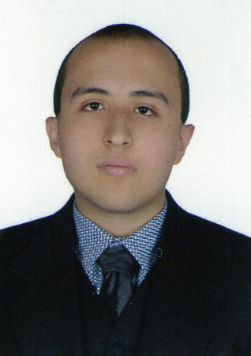
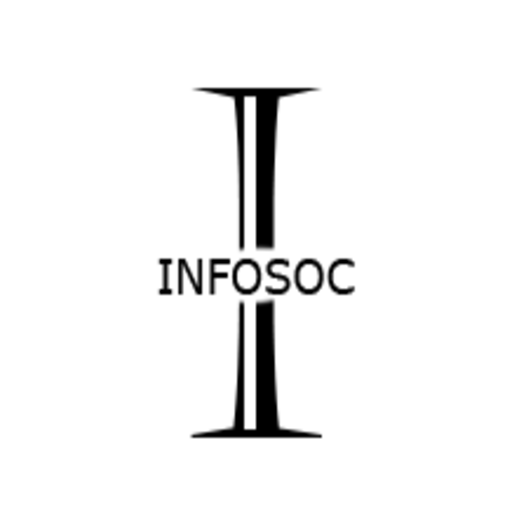

# Hola, mi nombre es Juan David Gamba S. 👋

### Tecnólogo en Análisis y Desarrollo de Sistemas de Información

<picture>

</picture>

Soy estudiante de Ingeniería de Sistemas en la UNAD desde el 2021, Tecnólogo en Análisis y Desarrollo de Sistemas de Información del SENA desde el 2020 y Técnico en Programación de Software del SENA desde 2018.
Desarrollo software con orientación a la web, con HTML, CSS, JS, PHP y MySQL y el framework Laravel con su stack de Inertia.js.

Me gustan temáticas científicas de la biología, y leer artículos de noticias y ocasionalmente de asuntos de ciencia, tecnología y cultura general.

Actualmente estoy trabajando en un sitio web de noticias locales para Bogotá, como proyecto de grado de la universidad UNAD.

## Encuéntrame en:

 

# Algunos de Mis Proyectos

## Proyectos de Desarrollo

<picture>

</picture>

## Videos en YouTube sobre los Proyectos

<table style="width: 100%;">
<tr>
<td><i>(Proyecto InfoSoc en YouTube)</i></td>
</tr>
</table>

# Contacto y Apoyo

